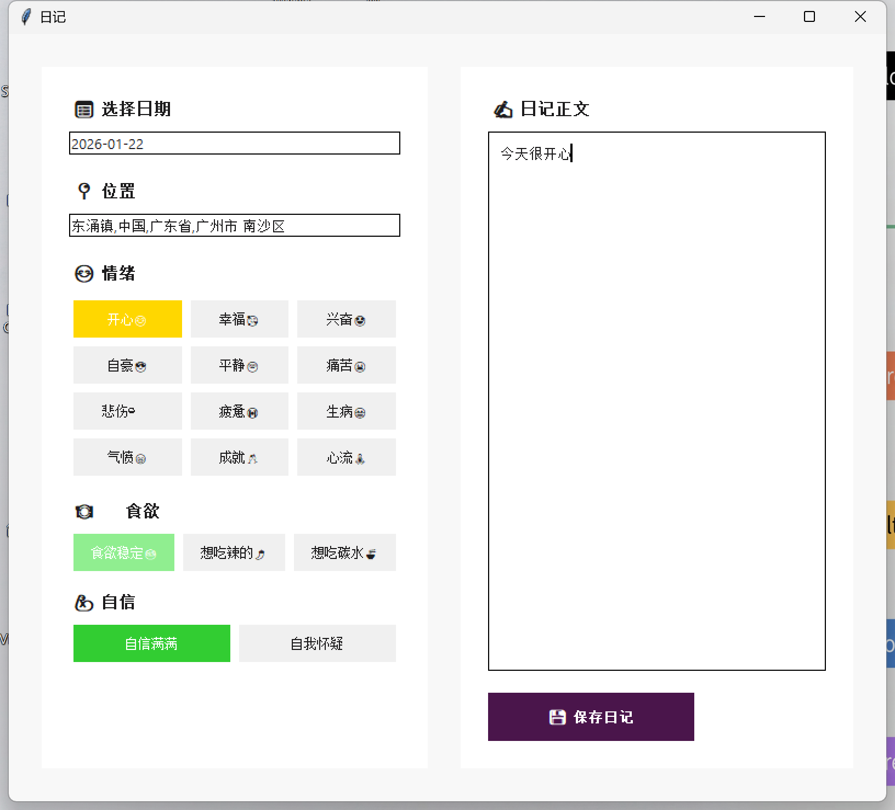
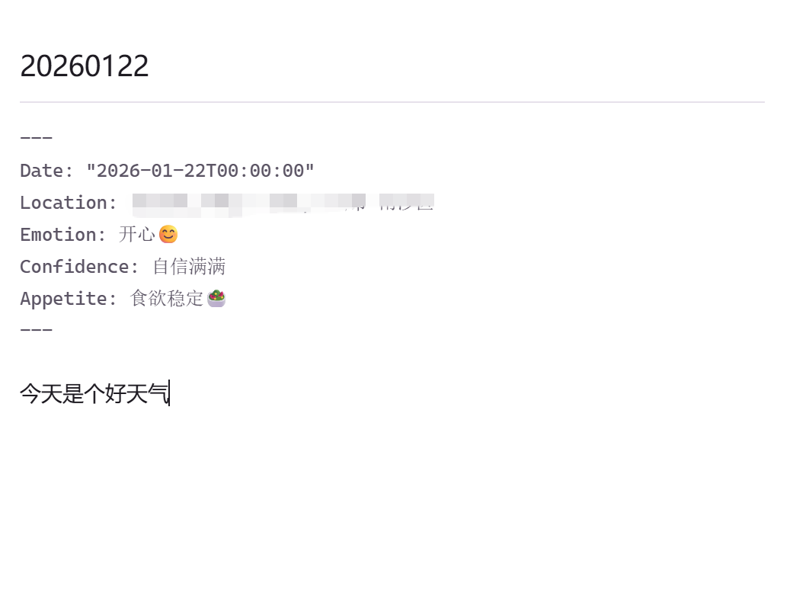

# mdJournal: 你的个人 Markdown 日记助手

mdJournal 是一个全面的个人日记解决方案，它将用户友好的图形界面与强大的数据分析和可视化功能相结合。它专为那些喜欢 Markdown 的简单性和便携性，并希望通过结构化数据和富有洞察力的分析来丰富日记体验的用户而设计。



## 生成的日记



## 主要功能

- **直观的每日条目 GUI：** 用于撰写每日日记条目的简单明了的界面。
- **带 YAML Frontmatter 的结构化数据：** 每个条目都是一个带有 YAML frontmatter 块的 Markdown 文件，允许您添加情绪、食欲和信心水平等结构化数据。
- **数据可视化：** 生成热力图以可视化您的情绪和其他指标随时间的变化，帮助您识别幸福感中的模式和趋势。
- **Outlook 集成：** 自动从 Outlook 获取您的每日日历事件，并将其包含在您的日记条目中。
- **可扩展和可定制：** 该项目使用 Python 构建，可以轻松定制以满足您的特定需求。

## 工作原理

该应用程序由几个协同工作的组件组成，以提供无缝的日记体验：

1.  **`diary_gui.py`：** 这是用于创建和管理日记条目的主要图形用户界面。它提供了一个简单的表单，用于撰写您的想法并选择您的情绪、食欲和信心水平。
2.  **`app.py`：** 一个基于 Flask 的 Web 应用程序，提供用于从 Outlook 获取数据和生成热力图的 API。
3.  **`obsidian_daily.py`：** 用于处理日记文件的实用函数集合，包括创建新条目、解析 frontmatter 和生成热力图。
4.  **`config.py`：** 一个配置文件，您可以在其中指定日记条目的基本目录。为了保护您的隐私，此文件不会被 Git 跟踪。


## 入门指南

1.  **克隆仓库：**
    ```bash
    git clone git@github.com:CarolRen233/mdJournal.git
    ```
2.  **安装依赖项：**
    ```bash
    pip install -r requirements.txt
    ```
3.  **配置您的日记目录：**
    -   在项目根目录中创建一个 `config.py` 文件。
    -   将以下行添加到 `config.py` 中，并将路径替换为您的日记目录的实际路径：
        ```python
        import pathlib
        BASE_DIR = pathlib.Path(r"D:\path\to\your\journal")
        ```
4.  **运行应用程序：**
    -   要启动用于撰写日记条目的 GUI，请运行：
        ```bash
        python diary_gui.py
        ```
    -   要启动用于查看热力图的 Web 界面，请运行：
        ```bash
        python app.py
        ```

## 构建可执行文件

该项目包含一个 `build_exe.py` 脚本，该脚本使用 PyInstaller 将应用程序打包为单个可执行文件。要构建可执行文件，只需运行：

```bash
python build_exe.py
```

这将在您的桌面上创建一个 `日记.exe` 文件。

## 贡献

欢迎贡献！如果您对改进项目有任何想法，请提出问题或提交拉取请求。

